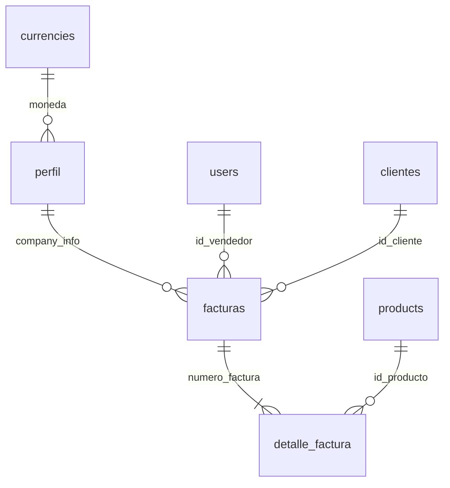

## Database Connection

Simple Invoice uses MySQL/MariaDB as its database system. Database configuration is managed through PHP constants defined in the configuration files.

### Configuration Constants

The database connection parameters are defined in `config/db.php`:

```php config/db.php
<?php
/*Datos de conexion a la base de datos*/
define('DB_HOST', 'localhost');//DB_HOST:  generalmente suele ser "127.0.0.1"
define('DB_USER', 'root');//Usuario de tu base de datos
define('DB_PASS', '');//Contraseña del usuario de la base de datos
define('DB_NAME', 'simple_invoice');//Nombre de la base de datos
?>
```

<ParamField path="DB_HOST" type="string" default="localhost">
  Database server host. Typically `localhost` or `127.0.0.1`
</ParamField>

<ParamField path="DB_USER" type="string" default="root">
  Database username with access to the Simple Invoice database
</ParamField>

<ParamField path="DB_PASS" type="string" default="">
  Database user password
</ParamField>

<ParamField path="DB_NAME" type="string" default="simple_invoice">
  Name of the database to use
</ParamField>

### Connection Implementation

The actual database connection is established in `config/conexion.php` using MySQLi:

```php config/conexion.php
<?php
# conectare la base de datos
$con=@mysqli_connect(DB_HOST, DB_USER, DB_PASS, DB_NAME);
if(!$con){
    die("imposible conectarse: ".mysqli_error($con));
}
if (@mysqli_connect_errno()) {
    die("Conexión falló: ".mysqli_connect_errno()." : ". mysqli_connect_error());
}
?>
```

<Warning>
  The connection script uses error suppression (`@`) and dies on failure. Ensure your database credentials are correct before deployment.
</Warning>

## Database Schema

Simple Invoice uses a relational database structure with the following core tables:

### Core Tables

<CardGroup cols={2}>
  <Card title="perfil" icon="building">
    Company profile and configuration settings
  </Card>
  <Card title="users" icon="users">
    System users and authentication
  </Card>
  <Card title="clientes" icon="address-card">
    Customer information
  </Card>
  <Card title="products" icon="box">
    Product catalog
  </Card>
  <Card title="facturas" icon="file-invoice">
    Invoice headers
  </Card>
  <Card title="detalle_factura" icon="list">
    Invoice line items
  </Card>
  <Card title="currencies" icon="dollar-sign">
    Supported currencies (32 currencies)
  </Card>
  <Card title="tmp" icon="clock">
    Temporary session data
  </Card>
</CardGroup>

### Table Relationships



### Key Relationships

- **facturas** → **clientes**: Each invoice is linked to a customer via `id_cliente`
- **facturas** → **users**: Each invoice is created by a user (seller) via `id_vendedor`
- **facturas** → **detalle_factura**: One-to-many relationship via `numero_factura`
- **detalle_factura** → **products**: Invoice items reference products via `id_producto`
- **perfil** → **currencies**: Company profile uses currency symbol from currencies table

## Database Setup

<Steps>
  <Step title="Create Database">
    Create a new MySQL database named `simple_invoice` (or your preferred name)
    ```sql
    CREATE DATABASE simple_invoice CHARACTER SET utf8 COLLATE utf8_unicode_ci;
    ```
  </Step>
  
  <Step title="Import Schema">
    Import the database schema from `simple_invoice.sql`
    ```bash
    mysql -u root -p simple_invoice < simple_invoice.sql
    ```
  </Step>
  
  <Step title="Configure Connection">
    Update the constants in `config/db.php` with your database credentials
  </Step>
  
  <Step title="Verify Connection">
    Access the application to verify the database connection is working
  </Step>
</Steps>

<Tip>
  The default admin user credentials after installation are:
  - **Username**: `admin`
  - **Password**: `admin` (password hash: `$2y$10$MPVHzZ2ZPOWmtUUGCq3RXu31OTB.jo7M9LZ7PmPQYmgETSNn19ejO`)
</Tip>

## Character Set

The database uses UTF-8 encoding to support international characters:

- Default charset: `utf8`
- Some tables use: `utf8_unicode_ci` collation
- Company profile table (`perfil`): `latin1`

## Storage Engines

- **MyISAM**: Used for most tables (clientes, products, facturas, detalle_factura, tmp)
- **InnoDB**: Used for users, perfil, and currencies tables

<Note>
  Consider migrating all tables to InnoDB for better transaction support and foreign key constraints.
</Note>